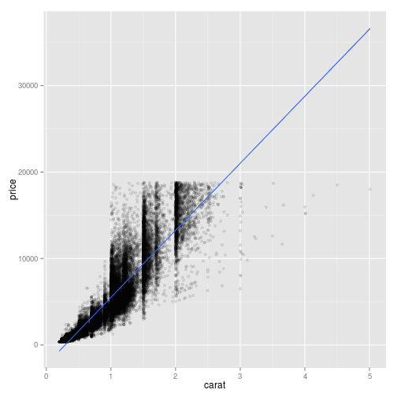

## Summary

This is a model for the prediction of the price of diamonds per carat.
A simple linear regression is used to make the model

The data is an internal example from R. And comes from the dataset 'diamonds'
An explanation of the dataset is given in this [link](https://vincentarelbundock.github.io/Rdatasets/doc/Ecdat/Diamond.html)

The price is in singapore dollars, in US$ that is multiplied by 0.70374 (on the 6th of november 2015)

--- .class #id 


## Analysis of the data

Here is the summary of the diamonds data. It is much more then what is done in this project. For this project we only need the price and the carat of the diamonds. No further analysis is done.


```r
library(ggplot2)
summary(diamonds)
```

```
##      carat               cut        color        clarity     
##  Min.   :0.2000   Fair     : 1610   D: 6775   SI1    :13065  
##  1st Qu.:0.4000   Good     : 4906   E: 9797   VS2    :12258  
##  Median :0.7000   Very Good:12082   F: 9542   SI2    : 9194  
##  Mean   :0.7979   Premium  :13791   G:11292   VS1    : 8171  
##  3rd Qu.:1.0400   Ideal    :21551   H: 8304   VVS2   : 5066  
##  Max.   :5.0100                     I: 5422   VVS1   : 3655  
##                                     J: 2808   (Other): 2531  
##      depth           table           price             x         
##  Min.   :43.00   Min.   :43.00   Min.   :  326   Min.   : 0.000  
##  1st Qu.:61.00   1st Qu.:56.00   1st Qu.:  950   1st Qu.: 4.710  
##  Median :61.80   Median :57.00   Median : 2401   Median : 5.700  
##  Mean   :61.75   Mean   :57.46   Mean   : 3933   Mean   : 5.731  
##  3rd Qu.:62.50   3rd Qu.:59.00   3rd Qu.: 5324   3rd Qu.: 6.540  
##  Max.   :79.00   Max.   :95.00   Max.   :18823   Max.   :10.740  
##                                                                  
##        y                z         
##  Min.   : 0.000   Min.   : 0.000  
##  1st Qu.: 4.720   1st Qu.: 2.910  
##  Median : 5.710   Median : 3.530  
##  Mean   : 5.735   Mean   : 3.539  
##  3rd Qu.: 6.540   3rd Qu.: 4.040  
##  Max.   :58.900   Max.   :31.800  
## 
```

--- 

## Model fitting

A model is fit with linear regression:


```r
fit <- lm(price ~ carat, data = diamonds)
```

The coefficients of the linear model are:


```r
fit$coefficients
```

```
## (Intercept)       carat 
##   -2256.361    7756.426
```

---

## Results

So a simple model for the prediction of the price is: 
Price = 0.70374 * (7756.425618 * carat + -2256.36058)
Finally a plot of the data with the regression line:

```r
ggplot(diamonds, aes(carat,price)) + geom_point(alpha=0.1) + geom_smooth(method="lm") 
```

 

---

## Finally

There is also a shiny app of this simple model.
It can be found [here](https://arnosk.shinyapps.io/diamonds)


